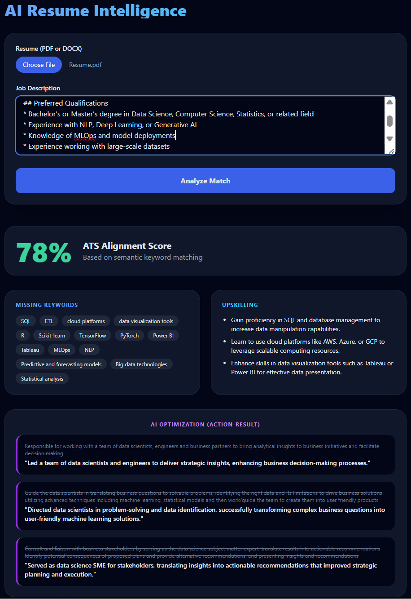
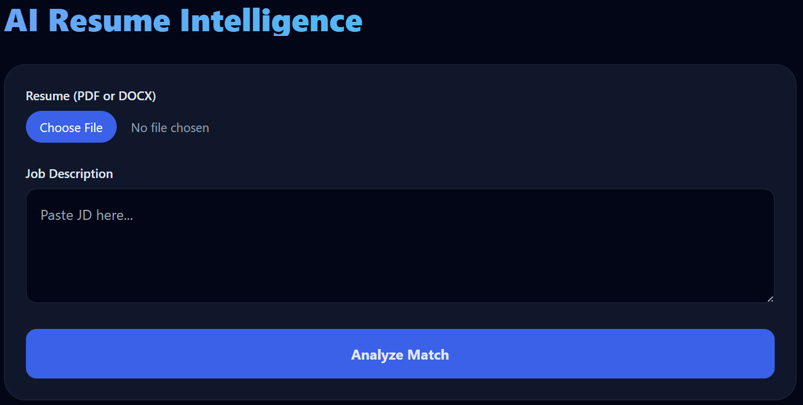
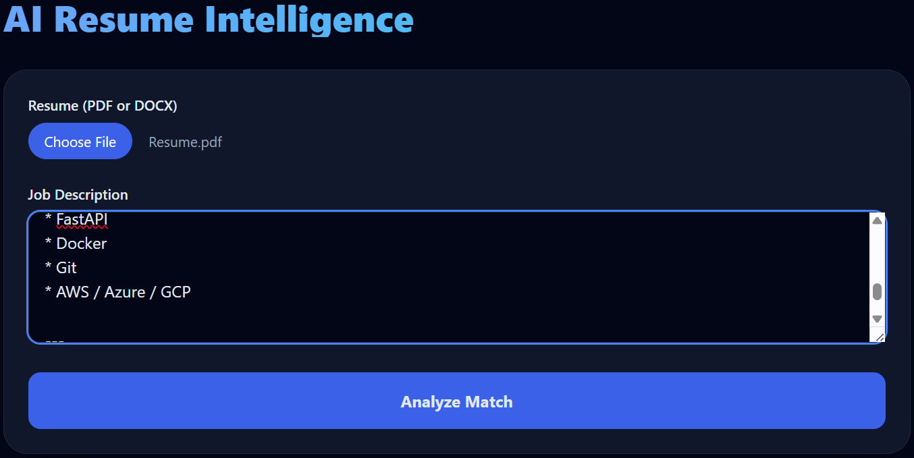

# AI-Driven Resume Intelligence & ATS Optimizer

An AI-powered SaaS-style resume analysis platform that leverages Large Language Models (LLMs) to perform intelligent resume parsing, ATS evaluation, job alignment analysis, and resume enhancement recommendations.

Built using GPT-4o, FastAPI, Python, and modern frontend technologies, the platform helps users optimize resumes for Applicant Tracking Systems (ATS) and improve alignment with target job descriptions.

---

## Screenshots

### Application Preview



---

## Features

* Resume parsing from PDF and DOCX files
* ATS compatibility scoring
* AI-powered job alignment analysis
* Keyword gap identification
* Resume enhancement recommendations
* Action-Result oriented bullet rewrites
* Structured prompt engineering pipeline
* JSON-mode response formatting
* Responsive web-based interface
* Async backend processing with FastAPI

---

## Tech Stack

### Backend

* Python
* FastAPI
* pdfplumber
* python-docx
* OpenAI GPT-4o API
* Async API processing

### Frontend

* HTML
* Tailwind CSS
* JavaScript

### AI/LLM Components

* GPT-4o
* Prompt Engineering
* Persona-based prompting
* Structured JSON outputs
* Resume-job semantic alignment

---

## Project Architecture

```text
User Resume + Job Description
            │
            ▼
    File Parsing Layer
   (PDF/DOCX Extraction)
            │
            ▼
   Structured Prompt Pipeline
    - ATS Evaluation
    - Resume Analysis
    - Keyword Matching
    - Rewrite Suggestions
            │
            ▼
      GPT-4o Processing
            │
            ▼
   JSON Structured Outputs
            │
            ▼
 Responsive Frontend Dashboard
```

---

## Screenshots

### Dashboard Interface



### Resume Analysis -- ATS Score, AI Rewrite & Recommendations


---

## Installation

### 1. Clone the Repository

```bash
git clone https://github.com/AnikNicks/genai-resume-parser.git
cd genai-resume-parser
```

---

### 2. Create Virtual Environment

#### Windows

```bash
python -m venv venv
venv\Scripts\activate
```

#### macOS/Linux

```bash
python3 -m venv venv
source venv/bin/activate
```

---

### 3. Install Dependencies

```bash
pip install -r requirements.txt
```

---

### 4. Configure Environment Variables

Create a `.env` file in the root directory:

```env
OPENAI_API_KEY=your_openai_api_key
```

---

## Running the Application

## 4. Configure Environment Variables

Create a `.env` file in the project root directory and add your OpenAI API key:

```env
OPENAI_API_KEY=your_openai_api_key_here
```

---

## 5. Start the FastAPI Backend

Run the backend server:

```bash
uvicorn backend.main:app --reload
```

Backend will start on:

```text
http://127.0.0.1:8000
```

---

## 6. Open the Frontend

Open the following file in your browser:

```text
backend/index.html
```

---

## 7. Use the Application

1. Upload a Resume (`PDF` or `DOCX`)
2. Paste the Job Description (JD)
3. Click **Analyze**

## Example Workflow

1. Upload a resume (PDF/DOCX)
2. Paste a target job description
3. System parses and extracts structured content
4. GPT-4o evaluates ATS compatibility
5. Platform identifies:

   * Missing keywords
   * Skill gaps
   * Weak bullet points
   * Resume-job mismatch
6. AI generates:

   * ATS score
   * Alignment insights
   * Action-Result rewrites
   * Upskilling recommendations

---

## Core Functionalities

### Resume Parsing

* Extracts text from PDF/DOCX resumes
* Detects sections such as:

  * Education
  * Experience
  * Skills
  * Projects

### ATS Optimization

* Measures keyword alignment
* Evaluates formatting compatibility
* Calculates ATS readiness score

### AI Resume Intelligence

* Semantic comparison between resume and job description
* LLM-generated improvement suggestions
* Bullet rewriting using measurable impact language

### Prompt Engineering Pipeline

* Persona-based prompts
* Structured JSON-mode outputs
* Modular prompt orchestration

---

## Future Enhancements

* Multi-job comparison
* Resume version tracking
* Cover letter generation
* LinkedIn profile optimization
* Vector database integration
* RAG-based career recommendations
* Multi-language resume support
* User authentication and dashboard analytics

---

## Repository

GitHub Repository:

[https://github.com/AnikNicks/genai-resume-parser](https://github.com/AnikNicks/genai-resume-parser)

---

## License

This project is intended for educational, research, and portfolio purposes.

---

## Acknowledgements

* OpenAI GPT-4o
* FastAPI
* Tailwind CSS
* pdfplumber
* Python Open Source Ecosystem
